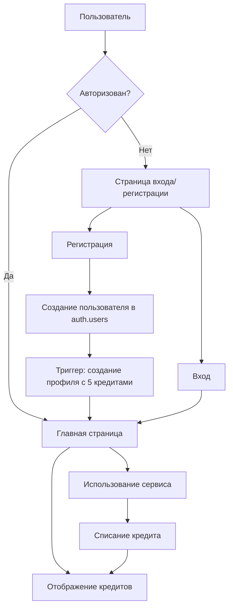

# План реализации системы аутентификации через Supabase

## Обзор проекта

Текущий проект — это YouTube Summarizer приложение на Next.js 16 с TypeScript. Необходимо добавить систему регистрации и авторизации пользователей через Supabase с системой кредитов.

## Архитектура системы



## Структура базы данных

### Таблица profiles

```sql
create table profiles (
  id uuid references auth.users not null primary key,
  email text,
  credits integer default 5,
  created_at timestamp with time zone default timezone('utc'::text, now()),
  updated_at timestamp with time zone default timezone('utc'::text, now())
);
```

### Триггер для автоматического создания профиля

При регистрации нового пользователя автоматически создаётся профиль с 5 кредитами.

### RLS политики

- Пользователи могут читать только свой профиль
- Пользователи могут обновлять только свой профиль

## Компоненты системы

### 1. Страница входа/регистрации

**Маршрут:** `/login`

Единая страница с переключением между режимами:
- Вход
- Регистрация

**Функционал:**
- Поле email
- Поле password
- Кнопка входа/регистрации
- Переключатель между режимами
- Валидация полей
- Отображение ошибок

### 2. Главная страница с кредитами

**Изменения в существующей странице:**
- Добавить проверку авторизации
- Отобразить количество кредитов в header
- Добавить кнопку выхода
- Показывать форму входа для неавторизованных пользователей

### 3. API роуты

**`/api/auth/signup`** - Регистрация
**`/api/auth/signin`** - Вход
**`/api/auth/signout`** - Выход
**`/api/auth/user`** - Получение данных пользователя

### 4. Middleware

Защита роутов и обновление сессии.

## Настройки Supabase

### Отключение подтверждения email

Для регистрации без подтверждения email необходимо:
1. В Dashboard перейти в Authentication → Providers
2. Для Email провайдера отключить "Confirm email"

Или через SQL:

```sql
-- Автоматическое подтверждение email при регистрации
update auth.users 
set email_confirmed_at = now() 
where email_confirmed_at is null;
```

## Пользовательский опыт

### Регистрация

1. Пользователь открывает приложение
2. Видит форму регистрации с приветственным сообщением
3. Вводит email и пароль
4. Нажимает "Зарегистрироваться"
5. Автоматически входит в систему
6. Видит главную страницу с 5 кредитами

### Вход

1. Пользователь вводит email и пароль
2. Нажимает "Войти"
3. Попадает на главную страницу
4. Видит свои кредиты

### Использование сервиса

1. Пользователь вводит ссылку на YouTube видео
2. Система проверяет наличие кредитов
3. Если кредиты есть — списывается 1 кредит и показывается результат
4. Если кредитов нет — показывается сообщение о необходимости покупки

## Файловая структура

```
app/
├── login/
│   └── page.tsx              # Страница входа/регистрации
├── auth/
│   └── callback/
│       └── route.ts          # Callback для OAuth
├── api/
│   ├── auth/
│   │   ├── signup/
│   │   │   └── route.ts      # API регистрации
│   │   ├── signin/
│   │   │   └── route.ts      # API входа
│   │   ├── signout/
│   │   │   └── route.ts      # API выхода
│   │   └── user/
│   │       └── route.ts      # API получения пользователя
│   └── summarize/
│       └── route.ts          # Существующий API (модифицировать)
lib/
├── supabase/
│   ├── client.ts             # Клиентский Supabase клиент
│   ├── server.ts             # Серверный Supabase клиент
│   └── middleware.ts         # Middleware для сессий
components/
├── auth/
│   ├── auth-form.tsx         # Форма входа/регистрации
│   └── user-menu.tsx         # Меню пользователя с кредитами
middleware.ts                 # Next.js middleware
```

## Этапы реализации

### Этап 1: База данных
1. Создать таблицу profiles через MCP
2. Создать триггер для автоматического создания профиля
3. Настроить RLS политики
4. Отключить подтверждение email в настройках

### Этап 2: Инфраструктура
1. Установить npm пакеты
2. Создать утилиты для Supabase
3. Создать middleware
4. Настроить переменные окружения

### Этап 3: UI компоненты
1. Создать форму входа/регистрации
2. Создать компонент отображения кредитов
3. Модифицировать главную страницу

### Этап 4: API
1. Создать роуты для аутентификации
2. Модифицировать API summarize для работы с кредитами

### Этап 5: Тестирование
1. Проверить регистрацию
2. Проверить вход
3. Проверить систему кредитов
4. Проверить редиректы

## Переменные окружения

```env
NEXT_PUBLIC_SUPABASE_URL=https://wdgchbnfgrnvgwduakmr.supabase.co
NEXT_PUBLIC_SUPABASE_ANON_KEY=<anon_key>
```

## Безопасность

1. RLS политики на всех таблицах
2. Валидация на сервере
3. Защита от брутфорса (встроено в Supabase)
4. HTTPS для всех запросов

## Дизайн UI

### Форма входа/регистрации

```
┌─────────────────────────────────────┐
│                                     │
│         Summarizer.                 │
│                                     │
│   Добро пожаловать!                 │
│   Зарегистрируйтесь и получите      │
│   5 бесплатных кредитов             │
│                                     │
│   ┌─────────────────────────────┐   │
│   │ Email                       │   │
│   └─────────────────────────────┘   │
│                                     │
│   ┌─────────────────────────────┐   │
│   │ Пароль                      │   │
│   └─────────────────────────────┘   │
│                                     │
│   [Зарегистрироваться]              │
│                                     │
│   Уже есть аккаунт? Войти           │
│                                     │
└─────────────────────────────────────┘
```

### Header с кредитами

```
┌─────────────────────────────────────┐
│  Summarizer.          💎 5 | Выйти  │
└─────────────────────────────────────┘
```

## Следующие шаги

После утверждения плана, переключиться в режим Code для реализации.
