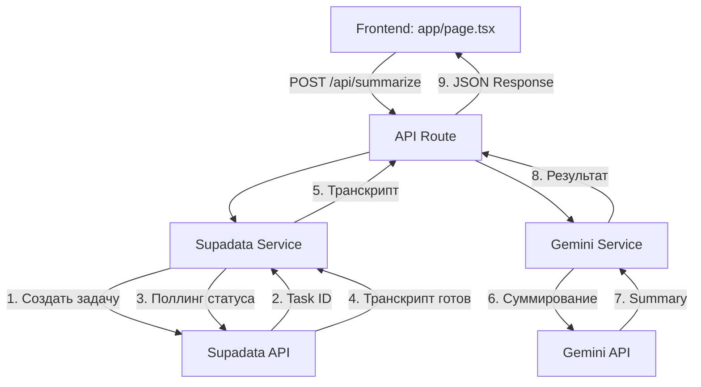
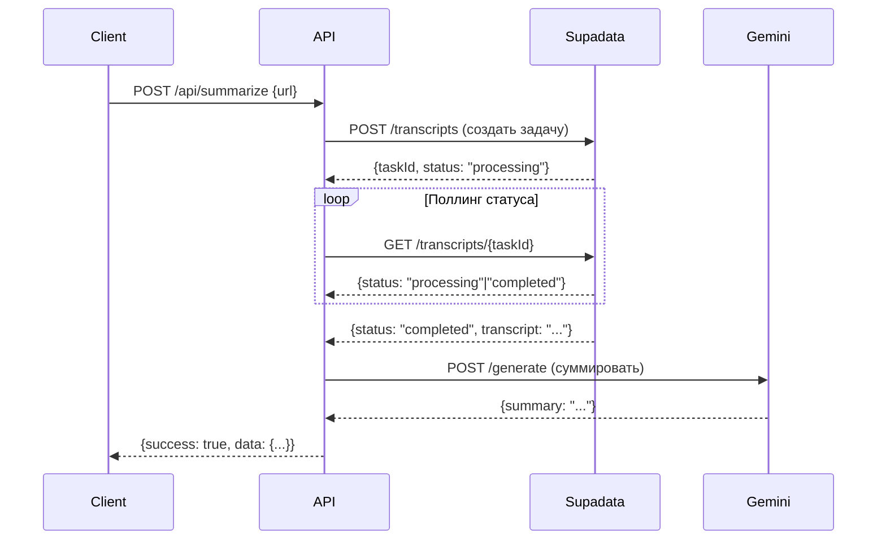

# План архитектуры бэк-энда для YouTube Summarizer

## Обзор

Бэк-энд для сервиса генерации саммари YouTube-роликов на основе Next.js App Router.

## Архитектура



## Структура файлов

```
Youtube_Summary/
├── .env.local                    # Локальные переменные окружения (не в git)
├── .gitignore                    # Исключает .env.local
├── lib/
│   ├── supadata.ts              # Интеграция с Supadata API
│   └── gemini.ts                # Интеграция с Gemini API
├── app/
│   └── api/
│       └── summarize/
│           └── route.ts         # API endpoint для суммирования
├── tests/
│   └── backend.test.ts          # Юнит-тесты с моками
└── jest.config.js               # Конфигурация Jest
```

## API Endpoints

### POST /api/summarize

**Request:**
```json
{
  "url": "https://www.youtube.com/watch?v=VIDEO_ID"
}
```

**Response (Success):**
```json
{
  "success": true,
  "data": {
    "videoTitle": "Название видео",
    "channelName": "Название канала",
    "thumbnailUrl": "https://img.youtube.com/vi/VIDEO_ID/maxresdefault.jpg",
    "sections": [
      {
        "title": "TL;DR",
        "points": ["Краткое описание видео"]
      },
      {
        "title": "Основные тезисы",
        "points": ["Тезис 1", "Тезис 2", ...]
      }
    ]
  }
}
```

**Response (Error):**
```json
{
  "success": false,
  "error": "Описание ошибки"
}
```

## Переменные окружения

| Переменная | Описание | Пример |
|------------|----------|--------|
| `SUPADATA_API_KEY` | API ключ для Supadata | `sk_...` |
| `GOOGLE_API_KEY` | API ключ для Google Gemini | `AIza...` |

## Vercel Best Practices

### 1. Eliminating Waterfalls (CRITICAL)
- Использовать `Promise.all()` для независимых операций
- В API route: запускать промисы рано, await поздно

### 2. Server-Side Performance (HIGH)
- Использовать `React.cache()` для дедупликации запросов
- Минимизировать данные, передаваемые клиенту

### 3. Bundle Size Optimization (CRITICAL)
- Импортировать только необходимые модули
- Использовать динамические импорты для тяжёлых компонентов

## Логика работы Supadata

1. **Создание задачи:** Отправить запрос на создание транскрипции
2. **Получение Task ID:** API возвращает ID асинхронной задачи
3. **Поллинг:** Периодически проверять статус задачи
4. **Получение результата:** Когда статус "completed", получить транскрипт



## Логика работы Gemini

1. **Модель:** `gemini-flash-lite-latest`
2. **Промпт:** Структурированный запрос на русском языке
3. **Формат вывода:** TL;DR + список тезисов

## Тестирование

### Стратегия тестирования

1. **Unit тесты** для `supadata.ts`:
   - Мок HTTP запросов к Supadata API
   - Тест поллинга асинхронных задач
   - Тест обработки ошибок

2. **Unit тесты** для `gemini.ts`:
   - Мок Google Generative AI SDK
   - Тест форматирования промпта
   - Тест парсинга ответа

3. **Integration тесты** для API route:
   - Мок всех внешних сервисов
   - Тест полного потока запрос-ответ
   - Тест обработки ошибок

## Деплой на Vercel

### Шаги деплоя через GitHub

1. **Настроить переменные окружения в Vercel:**
   - `SUPADATA_API_KEY`
   - `GOOGLE_API_KEY`

2. **Подключить репозиторий GitHub к Vercel**

3. **Vercel автоматически:**
   - Определит фреймворк (Next.js)
   - Запустит `npm run build`
   - Развернёт приложение

### Бесплатный аккаунт Vercel

- **Лимиты:** 100GB bandwidth, 6GB hours/month
- **Подходит для:** MVP и небольших проектов
- **API Routes:** Поддерживаются полностью

## Безопасность

1. **Ключи API:**
   - Хранятся в `.env.local` (локально)
   - Добавлены в переменные окружения Vercel
   - `.gitignore` исключает `.env.local`

2. **Rate Limiting:**
   - Vercel автоматически ограничивает запросы
   - Можно добавить дополнительную логику при необходимости

3. **Валидация:**
   - Валидация YouTube URL на клиенте
   - Дополнительная валидация на сервере

## Следующие шаги

1. Создать файлы бэк-энда
2. Добавить зависимости
3. Настроить тесты
4. Протестировать с реальными API
5. Подготовить к деплою
